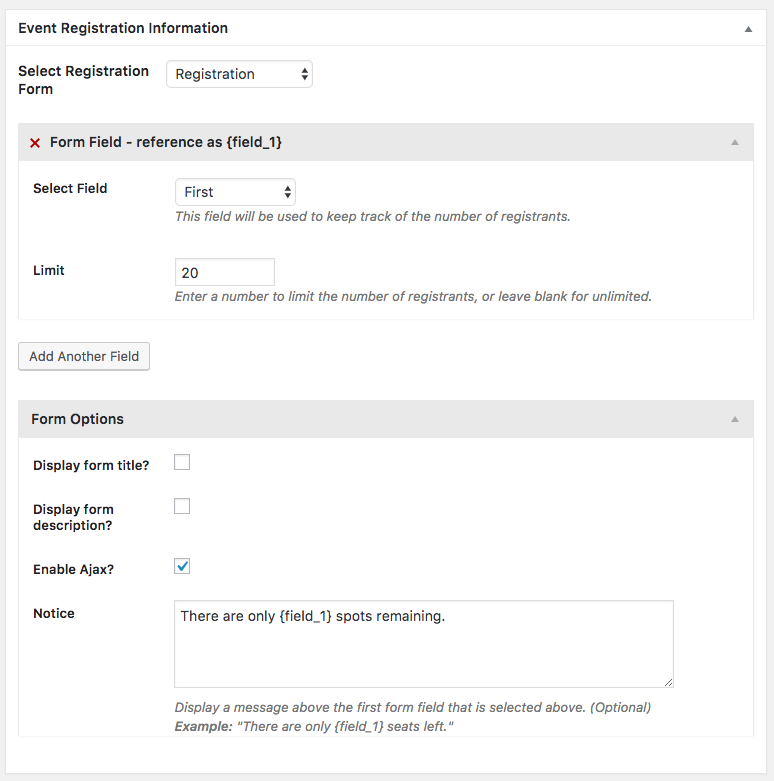

# Gravity Forms Registration for The Events Calendar

This plugin allows you to use Gravity Forms to handle registration for The Events Calendar events. Forms can be reused for multiple events without conflict.

## Requirements
- PHP 7.0+
- [Gravity Forms](http://www.gravityforms.com/)
- [The Events Calendar](https://wordpress.org/plugins/the-events-calendar/)

## Installation

Download the latest tagged release and install it using the WordPress plugin installer.

## Setup

1. First create a new Gravity Form. Make sure your form has one field that you can use to track the number of registrants. For example, this could be a "name" field if you only need to register one person per form submission.

2. Next, create a new event. You will see a new meta box on the event edit screen that allows you to select an event registration form. Select the form and the form field that will be used to track the number of people who have registered. For complex registration requirements, you may need to add additional form fields. For example, if your event can accommodate 20 adults and 10 children, then you should select a form field to track each of those registrant types. Enter a number to limit the number of registrations that the form can accept. 


3. Lastly, configure the Form Options. You can enter a notice that will be displayed within the form. This can be helpful if you want to notify users about how many reservations remain. Form notices will look like this: 


_Optional_: You can include basic event information in notification emails by adding the merge tag `{event_info}` to the Gravity Forms notification template.

## Usage

Once configured, the registration form will appear below the event meta information on the front end. The form can be repositioned with a couple of lines of code (see below).


Registration form entries can be viewed by clicking the `View registration entries` link found in the Event Registration Information meta box on the event edit screen.

## Customization
- Reposition the form:
```php
// Unhook the form and reposition it immediately after the event content area.
remove_action( 'tribe_events_single_event_after_the_meta', 'ForwardJump\ECGF_Registration\render_gravity_form' );
add_action( 'tribe_events_single_event_after_the_content', 'ForwardJump\ECGF_Registration\render_gravity_form', 5 );
```
- Change the registration notice position:
```php
add_filter( 'ecgf_form_notice_position', 'change_form_notice_position', 10, 3 );
/**
 * Filter the position of the form notice.
 *
 * @param string $insert_above_field The ID of the field where the notice will be displayed.
 * @param array  $form               Gravity Form object.
 * @param string $notice             The notice that will be displayed.
 * @return string
 */
function change_form_notice_position( $insert_above_field, $form, $notice ) {
	// Move notice to the top of the form.
	$first_form_field_id = $form['fields'][0]->id;

	return $first_form_field_id;
}
```
- Change the registration notice message:
```php
add_filter( 'ecgf_form_notice_text', 'change_form_notice_text', 10, 3 );
/**
 * Change the form notice text.
 *
 * @param string $updated_message Form notice that will be displayed to the user.
 * @param string $message         Original notice before it was updated.
 * @param array  $search_replace  Array of search replace pairs.
 * @return string
 */
function change_form_notice_text( $updated_message, $message, $search_replace ) {
	if ( in_array( 0, $search_replace ) ) {
		$updated_message = 'Oh no! We ran out of tickets.';
	}

	return $updated_message;
}
```

- Filter the field entry validation:
```php
add_filter( 'ecgf_field_validation_result', 'change_field_validation_result', 10, 5 );
/**
 * Filter the validation result.
 *
 * @param array  $result                 Validation result.
 * @param int    $available_reservations Number of available reservations.
 * @param string $value                  Form field value.
 * @param array  $form                   Form The current form to be filtered.
 * @param object $field                  Form field data.
 * @return array
 */
function change_field_validation_result( $result, $available_reservations, $value, $form, $field ) {

	if ( in_array( $available_reservations, range( 1, 5 ) ) ) {
		$result['is_valid'] = false;
		$result['message']  = "Sorry, there are only {$available_reservations} spots left, and we're saving those for someone else.";
	}

	return $result;
}
```

- Change the meta box configuration:
```php
add_filter( 'ecgf_post_metabox_config', 'modify_event_metabox_config' );
/**
 * Modifies the event registration meta box.
 *
 * @param array $config Configuration for building the post meta box.
 * @return array
 */
function modify_event_metabox_config( $config ) {
	$config[0]['metabox']['title'] = 'Registration Form';

	return $config;
}
```

### Credits
Built by [Tim Jensen](https://github.com/timothyjensen).


